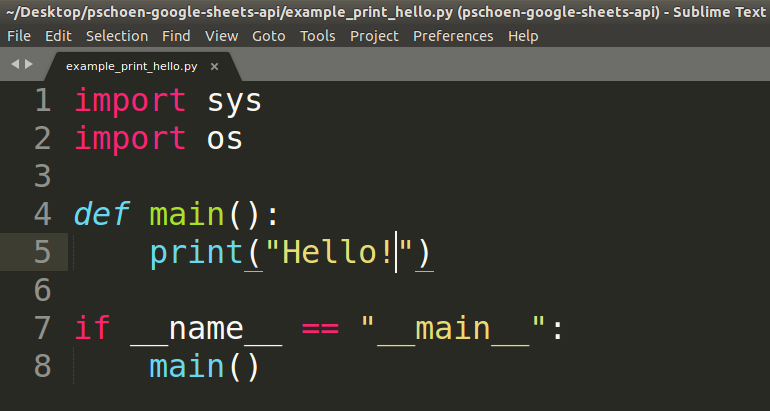

# Getting Started

## Start `Powershell`
---

This is the "command line" that will let you type commands directly to Windows.

To open it, see instructions [here](https://docs.microsoft.com/en-us/powershell/scripting/getting-started/starting-windows-powershell?view=powershell-6) (it should just be a few clicks to open).

The result should look be a window looking something like this:


Anytime you see something in here (or on guides online) that looks like:
```bash
$ some command
```

or:

```bash
> some command
```

They usually mean something typed into `Powershell`:

```
PS C:\Users\bschoen> some command
```

## Installing `chocolatey`
---
First, we'll install a thing called `chocolatey` which will make installing things on windows easy, using these steps: (steps from [here](https://chocolatey.org/install#installing-chocolatey))

1. Open powershell
2. Copy the command given [here](https://chocolatey.org/install#install-with-powershellexe) into powershell
3. Press enter

Now to install anything, we can just do:

```powershell
PS C:\Users\bschoen> choco install my_package_name
```

## Instal `git`
---

We'll use `git` to download this code. `git` is commonly used in software to share code and allow multiple people to edit it (it's basically `Google Sheets` for code).

To install it, we'll open powershell and run:

```powershell
> PS C:\Users\bschoen> choco install git
```

Now, to download the code for this project, we'll run:

```powershell
> PS C:\Users\bschoen> git clone https://github.com/b-schoen/pschoen-google-sheets-api.git
```

That will download the code into a new directory named `pschoen-google-sheets-api`.

## Installing `python`
---

To install python, we just open powershell and run:

```powershell
PS C:\Users\bschoen> choco install python
```

## Installing `sublime`
---

`Sublime` will let us edit python code with pretty coloring and formatting, making it much easier to read / write (you can think of it as Microsoft Word for python).

To install `sublime`, we'll open powershell and run:

```powershell
PS C:\Users\bschoen> choco install sublimetext3
```

Now we'll have a program installed called `sublime`. We can search for the program named `sublime` and open it. Then we'll open the `example_print_hello.py` file in `pschoen-google-sheets-api`. The result should be something like this:



## Running the script
---

To run our `example_print_hello.py` script, we'll:

1. Go to the `pschoen-google-sheets-api` directory:

```powershell
PS C:\Users\bschoen> cd pschoen-google-sheets-api
PS C:\Users\bschoen\pschoen-google-sheets-api> 
```

2. Run our script using python:

```powershell
PS C:\Users\bschoen\pschoen-google-sheets-api> python example_print_hello.py
```

You should see something like this in your powershell, which means the python script ran!

```python
"Hello!"
```
